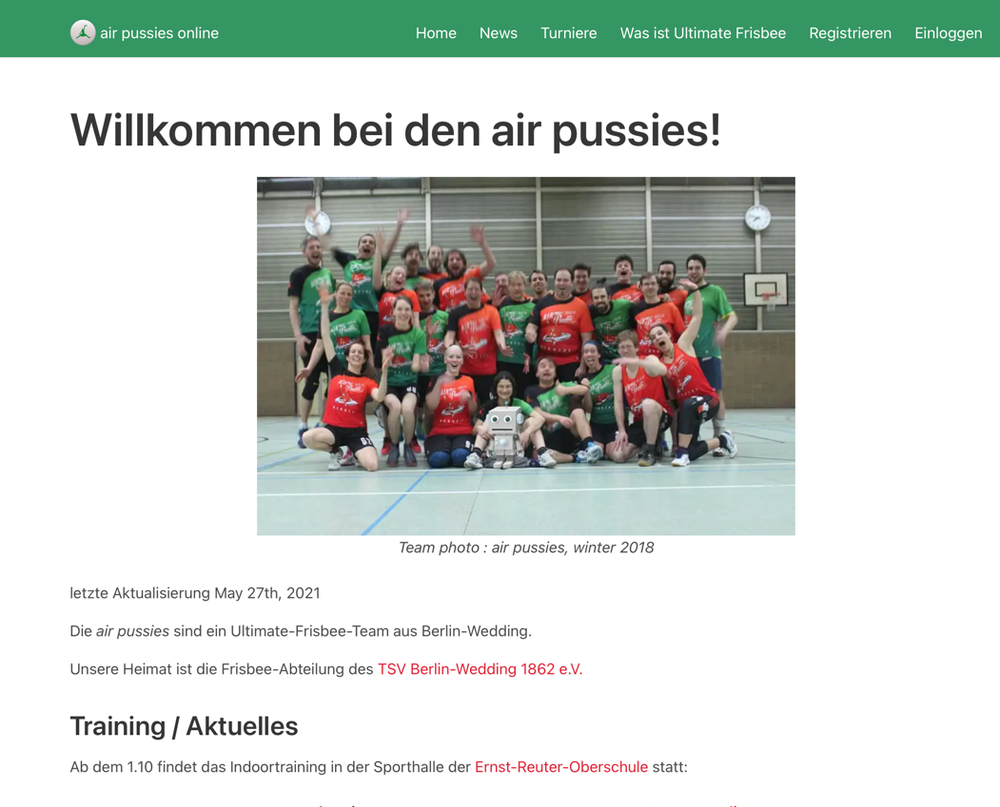
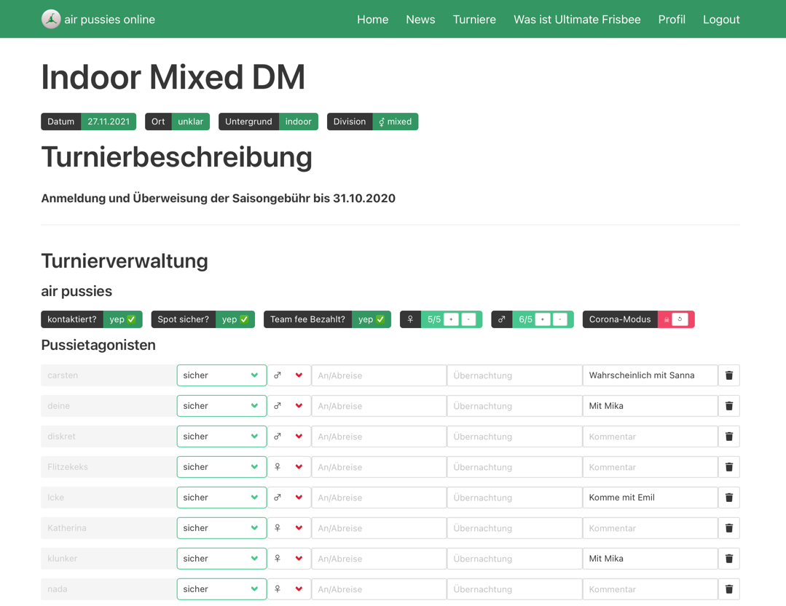

# air pussies web site

We're an [Ultimate](https://en.wikipedia.org/wiki/Ultimate_(sport)) team from Berlin, Germany. This repository
hold the code that generates our website: Visit us at [https://airpussies.berlin](https://airpussies.berlin)

## local development

This site makes use of the great [Contentful CMS](https://www.contentful.com/). To develop, you'll need

* a `CONTENTFUL_ACCESS_TOKEN` to access our CMS content
* nodejs (tested with version 14)
* [gatsby.js](https://www.gatsbyjs.com/docs/quick-start/) ([installation guide](https://www.gatsbyjs.com/docs/tutorial/part-0/#installation-guide))

then run `gatsby develop`

## tech stack

- Contentful CMS (content creation)
- gatsby.js (static site generation)
- [Google Firebase](https://firebase.google.com/) (used for the Turnierverwaltung: database and user mgmt)
- [bulma.io](https://bulma.io/) (CSS framework)
- [Netlify](https://www.netlify.com/) (hosting)

## Turnierverwaltung (tournament management)

This is part of our website where we can manage tournaments:

- attending players (incl. some details, state, comments, ...)
- track administrative actions (team and players fees, reservations, ...)
- details about the tournament (location, time, details, ...)

*Screenshot*

